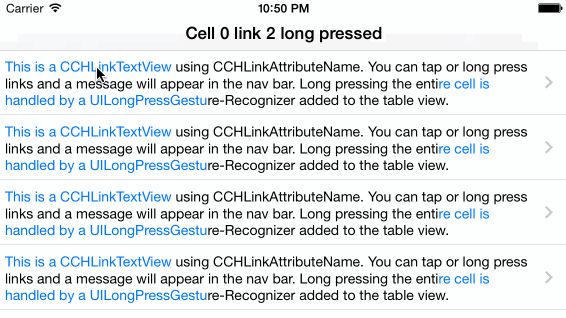

CCHLinkTextView
===============

[](https://travis-ci.org/choefele/CCHLinkTextView)&nbsp;&nbsp;

`CCHLinkTextView` makes it easy to embed links inside a `UITextView` and receive events for short and long taps. It looks and behaves similar to table cells used in popular Twitter apps such as Twitterrific or Tweetbot. `CCHLinkTextView` is available under the MIT license.



See [Changes](https://github.com/choefele/CCHLinkTextView/blob/master/CHANGES.md) for a high-level overview of recent updates.

Need to talk to a human? [I'm @claushoefele on Twitter](https://twitter.com/claushoefele).

## Alternatives

When using iOS 7's built-in link detection via `NSLinkAttributeName`, you will find that `textView:shouldInteractWithURL:inRange:` is only called when the user presses the link for a certain amount of time. This delay is frustrating for users because they expect an app to react instantly to taps.

In contrast to `UITextView`, `CCHLinkTextView` works great in `UITableView`s – even with `userInteractionEnabled` set to `YES` – because touches outside links are passed through to the `UITableView`. In addition, `CCHLinkTextView` provides events for short and long taps.

Compared to `OHAttributedLabel` and `TTTAttributeLabel`, `CCHLinkTextView` is written for iOS 7 using Text Kit functionality. This makes for a simpler implementation that avoids custom drawing code using CoreText. 

In contrast to `STTweetLabel`, `CCHLinkTextView` is a subclass of `UITextView` because `UILabel` has limited Text Kit support and adding this functionality can be quite hacky. `CCHLinkTextView` supports all of `UITextView`'s features and can also be used from within storyboards. Whereas `STTweetLabel` places its links on certain hotwords, you can mark any text range as a link with `CCHLinkTextView`. 

## Usage

- [Installation](#installation)
- [Creating `CCHLinkTextView`s](#creating-cchlinktextviews)
- [Advanced settings](#advanced-settings)
- [Embedding `CCHLinkTextView`s into table view cells](#embedding-cchlinktextviews-into-table-view-cells)

### Installation

Use [CocoaPods](http://cocoapods.org) to integrate `CCHLinkTextView` into your project. Minimum deployment target is iOS 7.0 because this project uses Text Kit functionality.

```ruby
platform :ios, '7.0'
pod "CCHLinkTextView"
```

### Creating `CCHLinkTextView`s

A `CCHLinkTextView` can be created manually via `initWithFrame:` or inside a storyboard. By default, it is non-editable and non-selectable as this would interfere with the link gestures. Otherwise, a `CCHLinkTextView` behaves like a `UITextView`.

### Setting up links

Text can be marked as a link by adding the attribute `CCHLinkAttributeName` to the range of the link:

```Obj-C
NSMutableAttributedString *attributedText = [linkTextView.attributedText mutableCopy];
[attributedText addAttribute:CCHLinkAttributeName value:@"0" range:NSMakeRange(0, 20)];
linkTextView.attributedText = attributedText;
```

If you have code using `NSLinkAttributeName`, you can simply replace it with `CCHLinkAttributeName`.

The `value` can be anything you want and will be provided when the link fires. To receive link events, implement `CCHLinkTextViewDelegate` and set the `linkDelegate` property. `CCHLinkTextViewDelegate` provides two callbacks:

```Obj-C
- (void)linkTextView:(CCHLinkTextView *)linkTextView didTapLinkWithValue:(id)value;
- (void)linkTextView:(CCHLinkTextView *)linkTextView didLongPressLinkWithValue:(id)value;
```

The first method is called for taps, the second for long presses.

To style the links, use `linkTextAttributes` and `linkTextTouchAttributes`. These dictionaries contain `NSAttributedString` attributes applied to links as they appear normally and when touched. By default, `linkTextAttributes` sets the tint color as foreground color and `linkTextTouchAttributes` a light gray background. 

Use `linkCornerRadius` to make the background on touch as a rounded rectangle.

### Advanced settings

There are a few settings to allow you to adjust `CCHLinkTextView`'s behavior:

- `minimumPressDuration`: The minimum period fingers must press on the link for the gesture to be recognized as a long press (default = 0.5s)
- `allowableMovement`: The maximum movement of the fingers on the link before the gesture is ignored (default = 10 points)
- `tapAreaInsets`: Expands or shrinks the tap area of the link text (default: {-5, -5, -5, -5})

`tapAreaInsets` can be debugged using Xcode's Quick Look feature, which will show the tappable area of a `CCHLinkTextView`.

### Embedding `CCHLinkTextView`s into table view cells

`CCHLinkTextView` works great inside `UITableViewCell`s because gestures outside links are forwarded to the container view. This means that standard delegate methods such as `tableView:didSelectRowAtIndexPath:` are called as normal.

If you want to capture long presses on a `UITableViewCell`, you can register a `UILongPressGestureRecognizer` with the `UITableView`. Note that you have to require `CCHLinkTextView`'s gesture recognizer to fail before the `UILongPressGestureRecognizer` fires. Otherwise, a long press on a link will trigger both the `CCHLinkTextViewDelegate` and the `UILongPressGestureRecognizer` callback. To implement this, simply call

    [self.longPressGestureRecognizer requireGestureRecognizerToFail:linkTextView.linkGestureRecognizer];
    
for every `CCHLinkTextView` (see example code in this project).

## License (MIT)

Copyright (C) 2014 Claus Höfele

Permission is hereby granted, free of charge, to any person obtaining a copy of this software and associated documentation files (the "Software"), to deal in the Software without restriction, including without limitation the rights to use, copy, modify, merge, publish, distribute, sublicense, and/or sell copies of the Software, and to permit persons to whom the Software is furnished to do so, subject to the following conditions:

The above copyright notice and this permission notice shall be included in all copies or substantial portions of the Software.

THE SOFTWARE IS PROVIDED "AS IS", WITHOUT WARRANTY OF ANY KIND, EXPRESS OR IMPLIED, INCLUDING BUT NOT LIMITED TO THE WARRANTIES OF MERCHANTABILITY, FITNESS FOR A PARTICULAR PURPOSE AND NONINFRINGEMENT. IN NO EVENT SHALL THE AUTHORS OR COPYRIGHT HOLDERS BE LIABLE FOR ANY CLAIM, DAMAGES OR OTHER LIABILITY, WHETHER IN AN ACTION OF CONTRACT, TORT OR OTHERWISE, ARISING FROM, OUT OF OR IN CONNECTION WITH THE SOFTWARE OR THE USE OR OTHER DEALINGS IN THE SOFTWARE.
